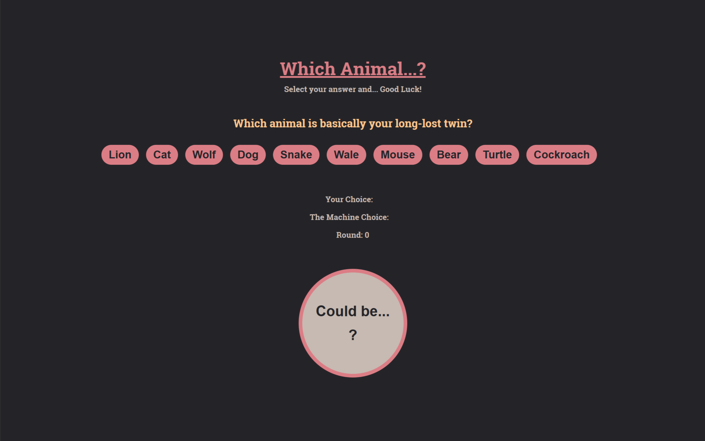
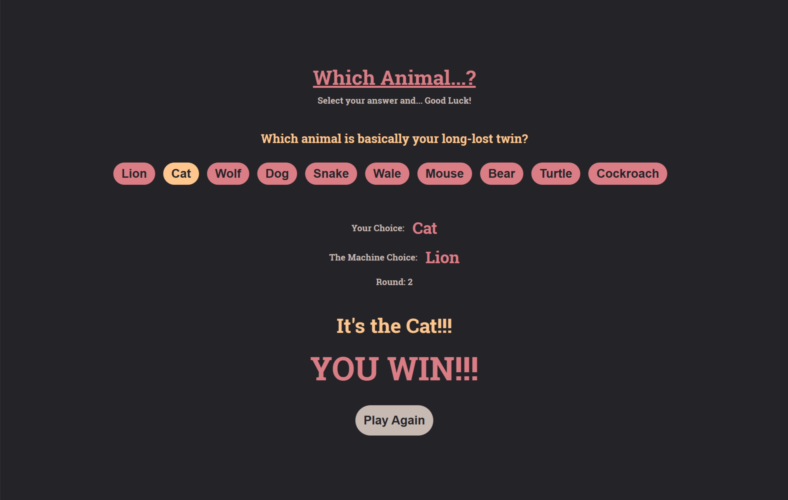
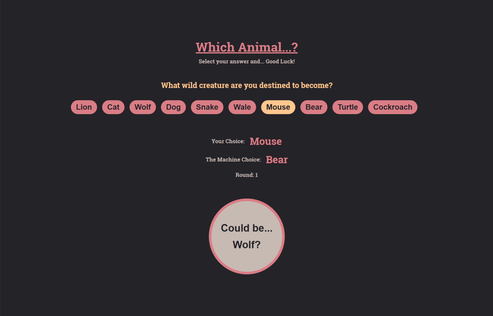
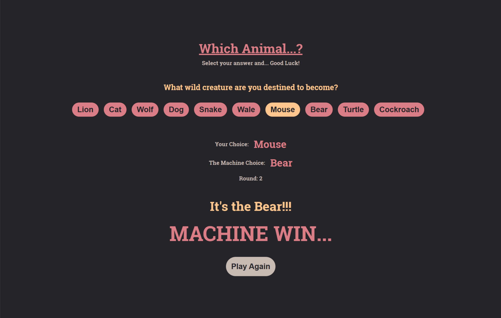

# ✨ Which Animal...?  
A Fun Random Animal Game 🎲🐻  
Pick an animal, let the machine choose too, and see what fate decides!

🎭 Randomly generated fun questions  
🦊 Try your luck and beat the machine!  
💻 Built with React + Vite

👉 Give it a try and see if you're destined to be a lion or a cockroach! 🦁🪳

---

## 🛠 Project Setup

This project was created using **React** with **Vite**. Here's how to get started:

### 📦 Requirements

- Node.js (version 18+ recommended)
- npm

### 🚀 Installation

1. Clone the repository  
2. Run `npm install` to install dependencies  
3. Use the commands below to start the project

### 📜 Available Commands

| Command           | Description                          |
|-------------------|--------------------------------------|
| `npm run dev`     | Starts the development server        |
| `npm run build`   | Builds the production version        |
| `npm run preview` | Previews the production build        |
| `npm run lint`    | Runs ESLint on the project           |

---

## 📸 Screenshots

---

## 🌐 Español

### 🐾 ¿Which Animal...?

Un divertido juego de animales aleatorios 🎲🐶  
Elige un animal, deja que la máquina elija otro y ¡mira quién gana!

🎭 Preguntas divertidas generadas aleatoriamente  
🦊 Pon a prueba tu suerte y vence a la máquina  
💻 Hecho con React + Vite

👉 ¡Descubre si estás destinado a ser un león o una cucaracha! 🦁🪳

---

### 🛠 Configuración del proyecto

Este proyecto fue creado con **React** y **Vite**. Aquí tienes cómo empezar:

### 📦 Requisitos

- Node.js (recomendado versión 18+)
- npm

### 🚀 Instalación

1. Clona el repositorio  
2. Ejecuta `npm install` para instalar dependencias  
3. Usa los siguientes comandos para comenzar:

### 📜 Comandos disponibles

| Comando           | Descripción                                  |
|-------------------|----------------------------------------------|
| `npm run dev`     | Inicia el servidor de desarrollo             |
| `npm run build`   | Genera la versión para producción            |
| `npm run preview` | Previsualiza la build                        |
| `npm run lint`    | Ejecuta ESLint en el proyecto                |

---

Enjoy the game! 🎉 / ¡Disfruta del juego! 🐾
